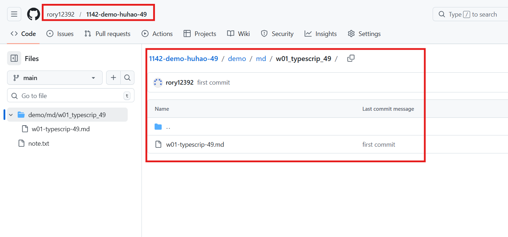
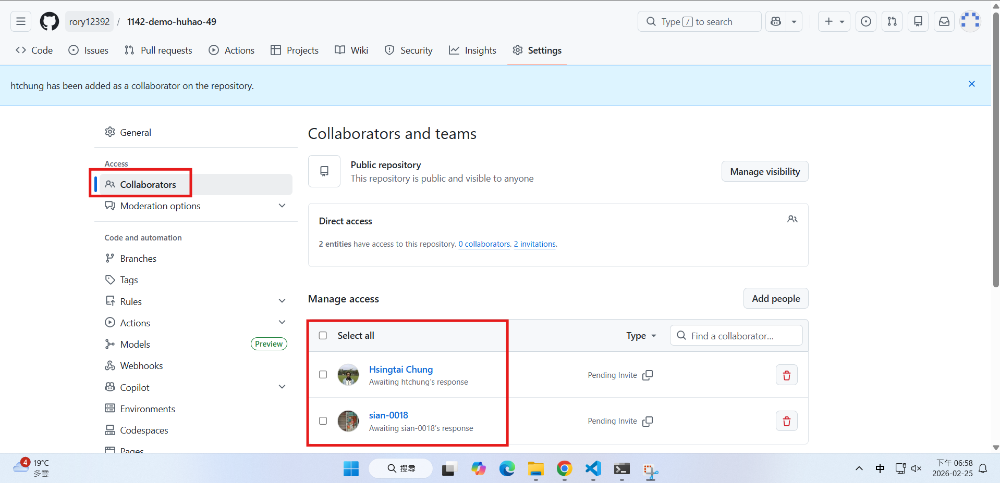
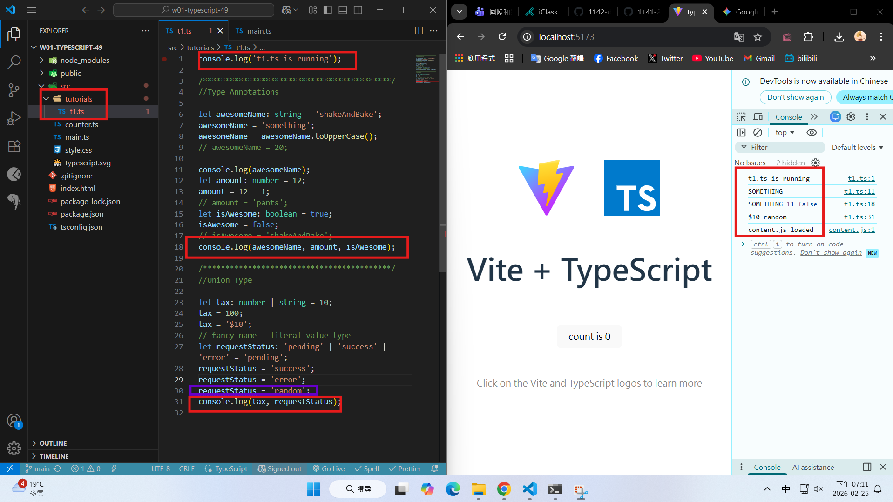
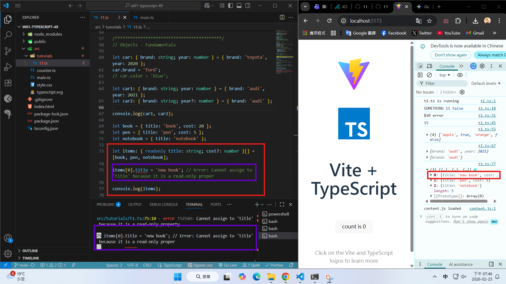
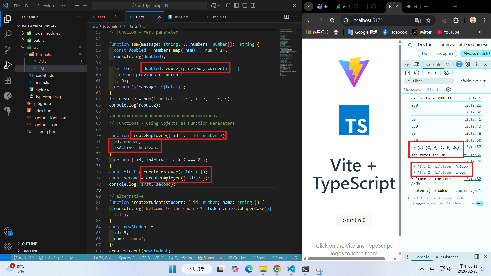
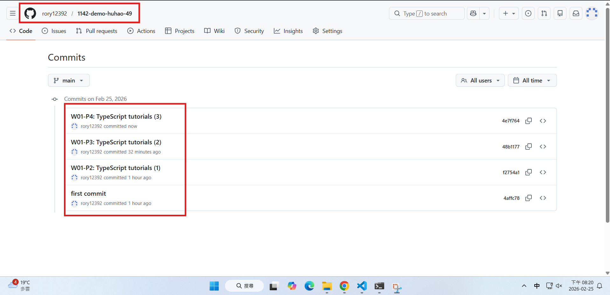

[Github URL](https://github.com/rory12392/1142-demo-huhao-49)

### W01-P1: Setup Github

#### => Github demo URL



#### => share to the teacher and TA



```
4affc78 rory12392 Wed Feb 25 18:56:05 2026 +0800  first commit
```

### W01-P2: TypeScript tutorials (1)

#### => Type Annotation and Union Type



```
f2754a1 rory12392 Wed Feb 25 19:13:35 2026 +0800  W01-P2: TypeScript tutorials (1)
```

### W01-P3: TypeScript tutorials (2)

#### => Object Fundamental, npm run build error when typechecking failed



```
48b1177 rory12392 Wed Feb 25 19:47:50 2026 +0800  W01-P3: TypeScript tutorials (2)
```

### W01-P4: TypeScript tutorials (3)

#### => Function Fundamentals



```
4e7f764 rory12392 Wed Feb 25 20:19:30 2026 +0800  W01-P4: TypeScript tutorials (3)
```

### W01-logs: git logs of W01


