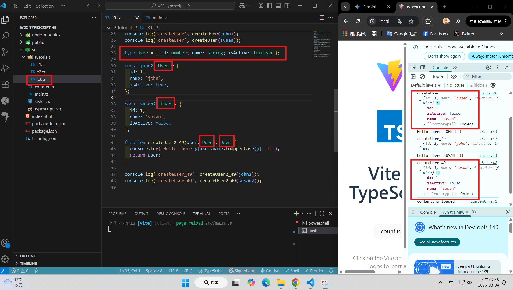
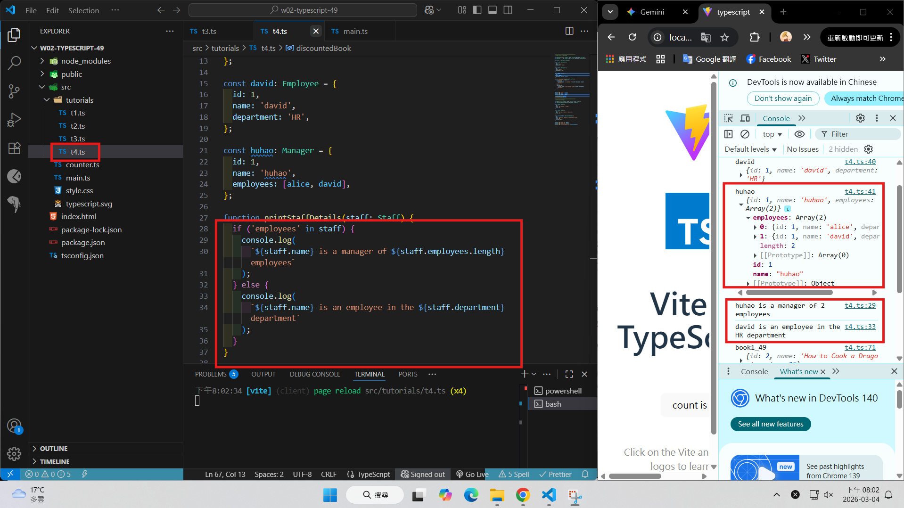
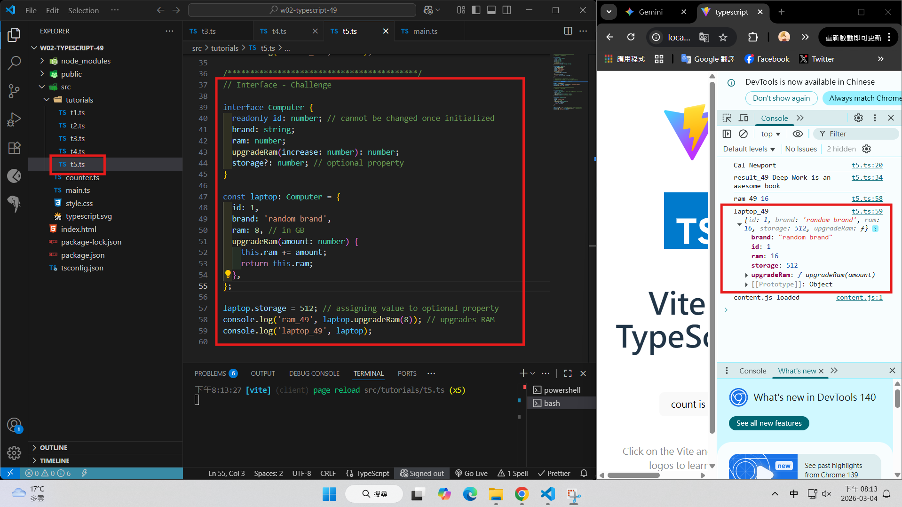
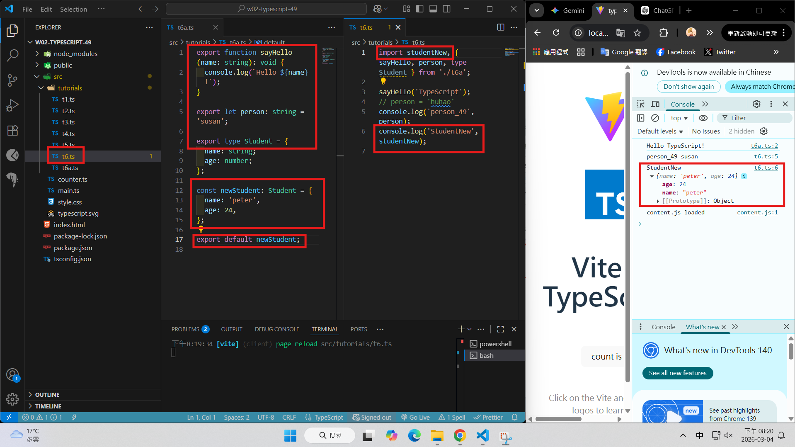
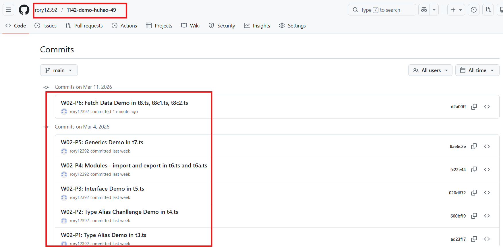

[Github URL](https://github.com/rory12392/1142-demo-huhao-49)

### W02-P1: Type Alias Demo in t3.ts



```
ad23f17 rory12392 Wed Mar 4 19:50:03 2026 +0800 W02-P1: Type Alias Demo in t3.ts
```

### W02-P2: Type Alias Chanllenge Demo in t4.ts



```
600bf19 rory12392 Wed Mar 4 20:05:53 2026 +0800 W02-P2: Type Alias Chanllenge Demo in t4.ts
```

### W02-P3: Interface Demo in t5.ts



```
020d672 rory12392 Wed Mar 4 20:15:26 2026 +0800 W02-P3: Interface Demo in t5.ts
```

### W02-P4: Modules - import and export in t6.ts and t6a.ts



```

```

### W02-logs: git logs of W02


