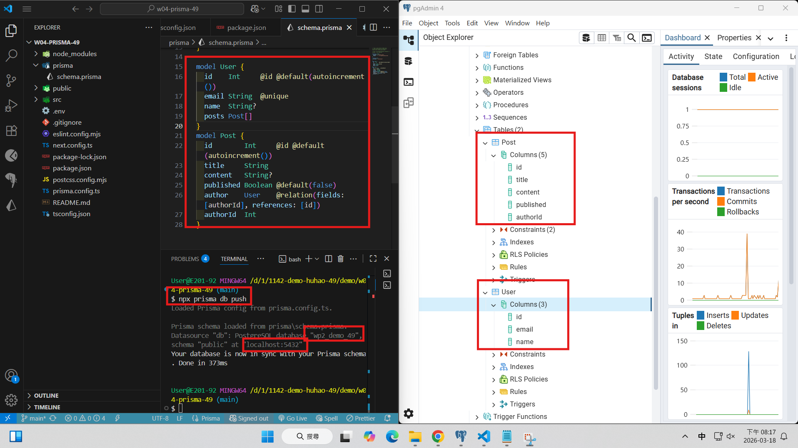
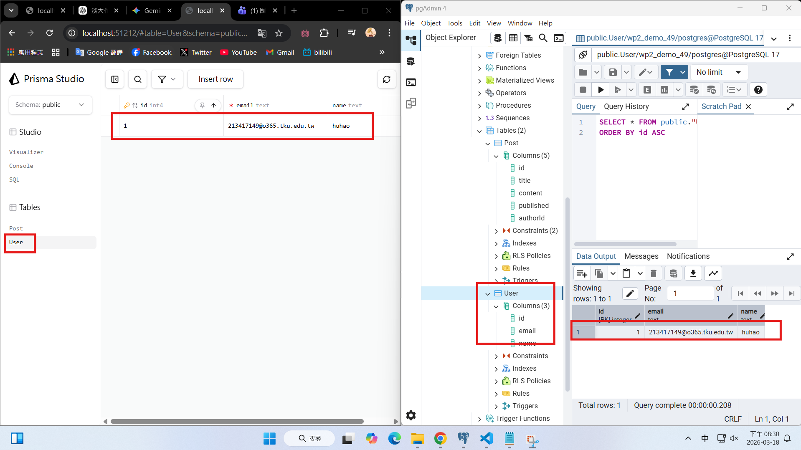
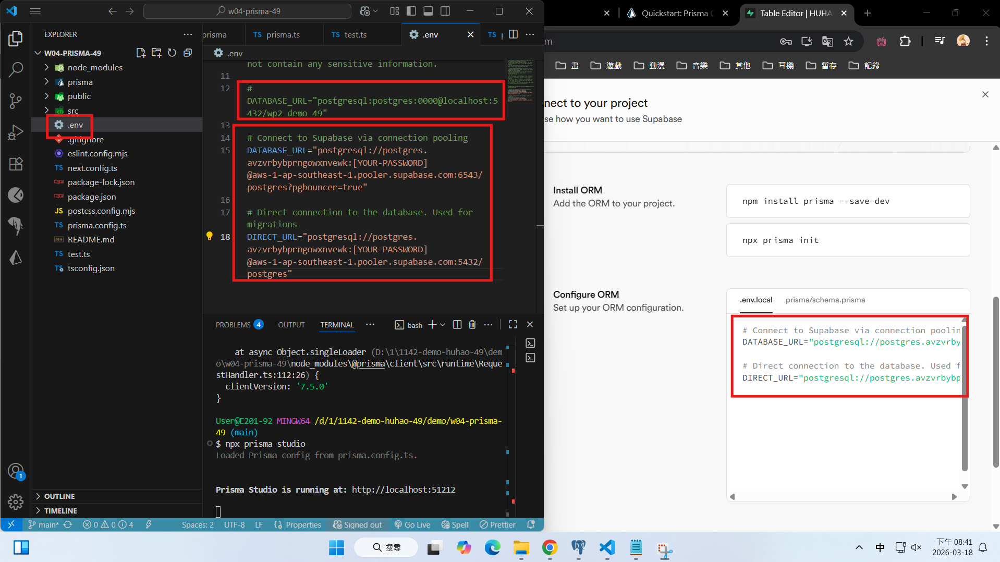
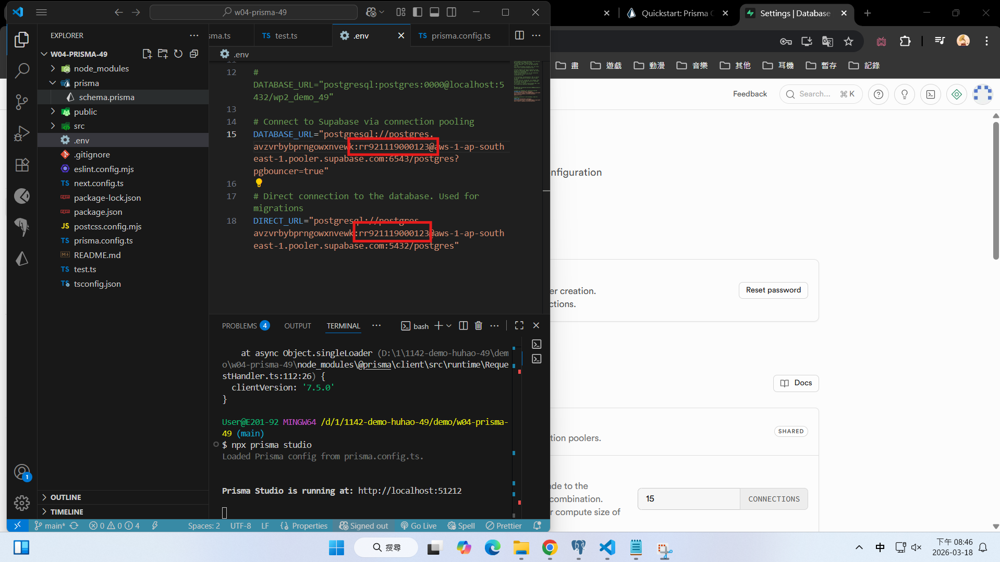
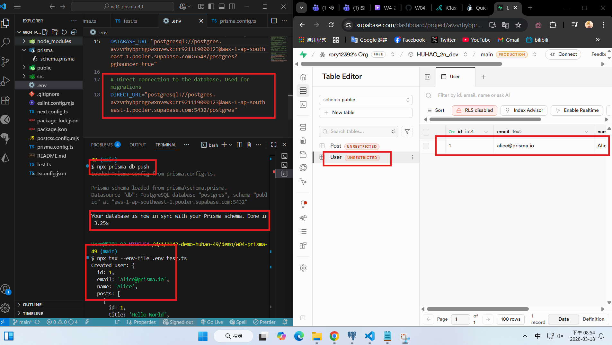
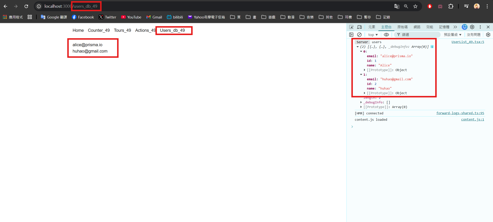
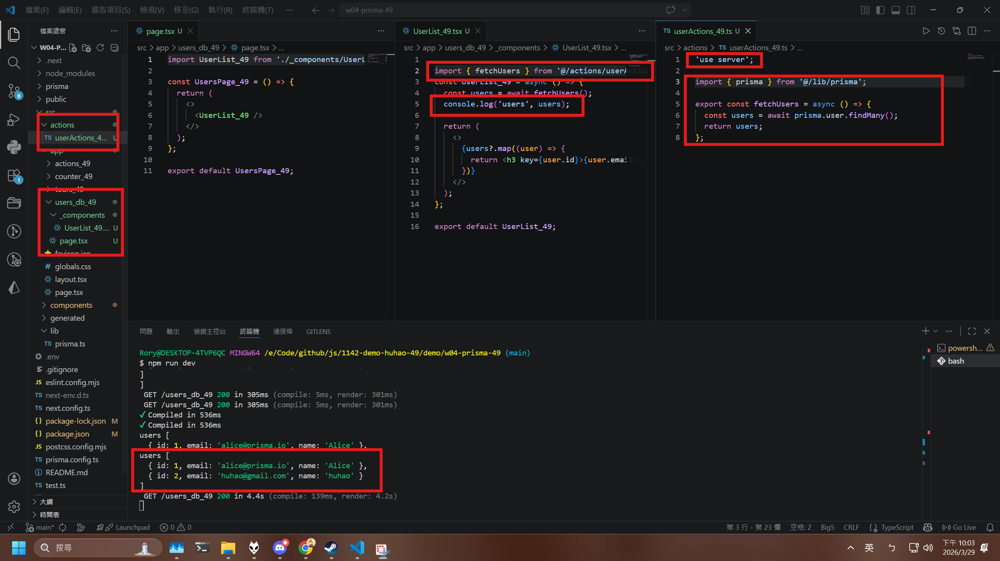
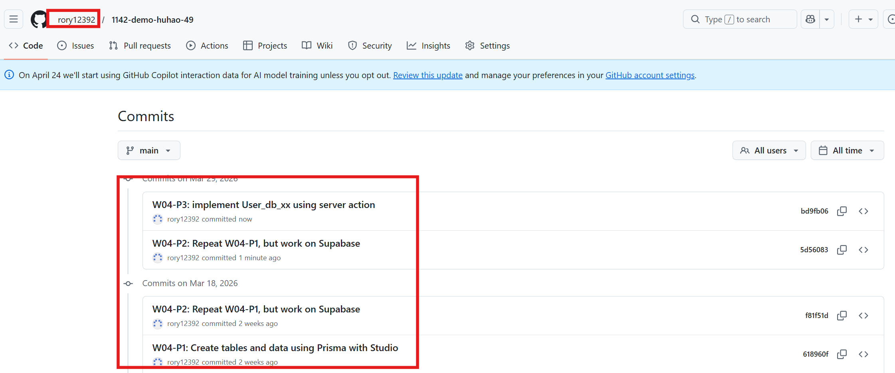

[Github URL](https://github.com/rory12392/1142-demo-huhao-49)

### W04-P1: Create tables and data using Prisma with Studio

#### => npx prisma db push



#### => add one user (your info), show in Prisma Studio and pgAdmin



```
618960f rory12392 Wed Mar 18 20:34:41 2026 +0800 W04-P1: Create tables and data using Prisma with Studio
```

### W04-P2: Repeat W04-P1, but work on Supabase

#### => connection setting in Supabase



#### => reset database password in Supabase



#### => npx prisma db push & run test.ts to add 1 user with 1 post



```
f81f51d rory12392 Wed Mar 18 20:55:40 2026 +0800 W04-P2: Repeat W04-P1, but work on Supabase
```

### W04-P3: implement User_db_xx using server action
 
#### => Chrome, show 2 users fetch from Supabase
 

 
#### => show the code, the concept of server action
 

 
```
bd9fb06 rory12392 Sun Mar 29 22:07:39 2026 +0800 W04-P3: implement User_db_xx using server action
```

### W04 logs: git logs of W04


