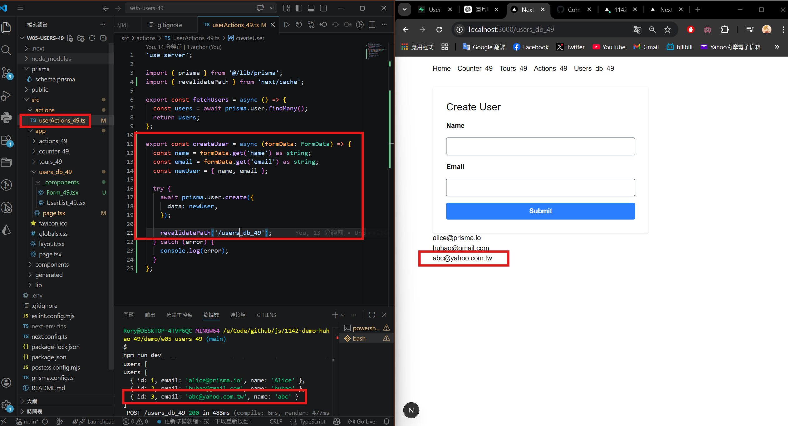
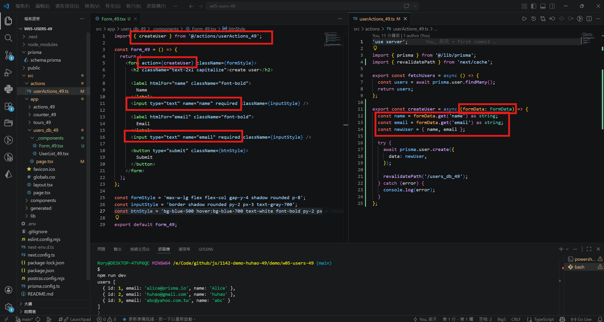
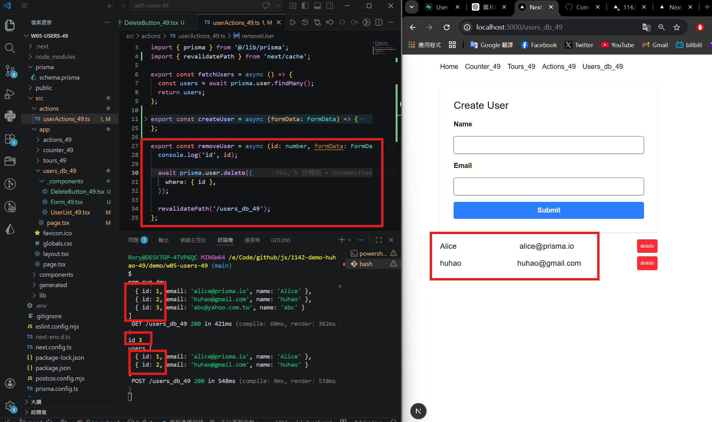
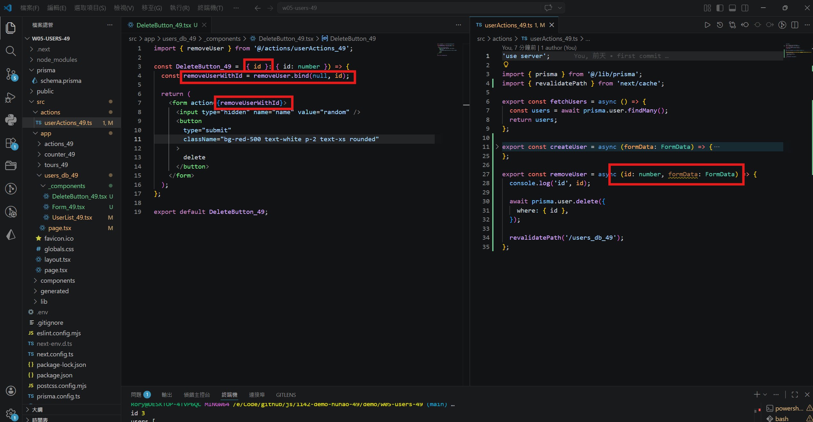
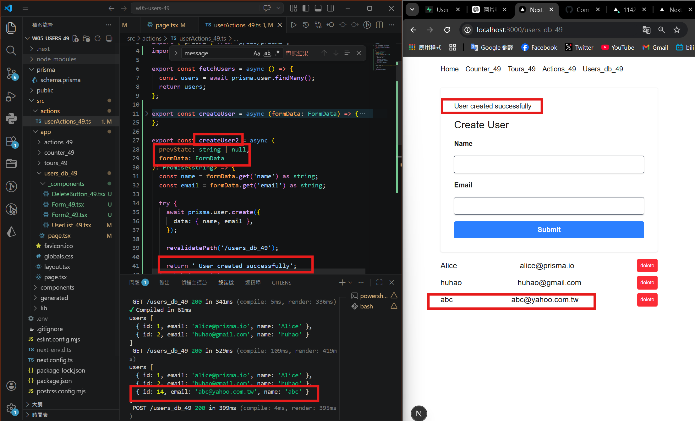
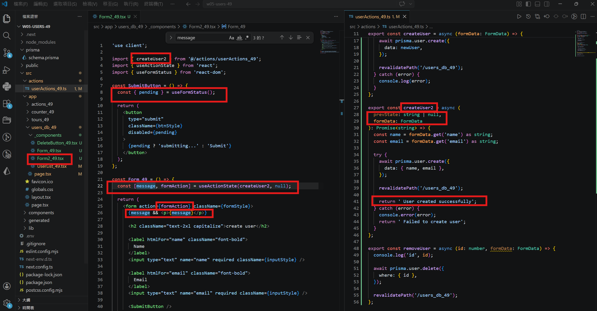

[Github URL](https://github.com/rory12392/1142-demo-huhao-49)

### W05-P1: Create a new Github repo and deploy to Vercel
 
#### => "npm run build" with success
 

 
#### => Deploy to Vercel, add env variables
 

 
#### => Show users fetch from Supabase
 

 
#### => Github repo with Vercel link
 

 
```
5f2bbe8 rory12392 Sun Apr 5 00:53:18 2026 +0800 W05-P1: Create a new Github repo and deploy to Vercel
```

### W05-P2: Create User using server action
 
#### => input an user and save it to Supabase
 

 
#### => show how formData works
 

 
```
9e8df66 rory12392 Sun Apr 5 01:18:45 2026 +0800 W05-P2: Create User using server action
```

###¡@W05-P3: Delete an user from Supabase
 
#### => from console.log show an user being deleted
 

 
#### => show how code is working
 

 
```
3e8b027 rory12392 Sun Apr 5 01:34:28 2026 +0800 W05-P3: Delete an user from Supabase
```

### W05-P4: Refine Form_xx using useFormStatus and useFormState
 
#### => create an user and show return message
 

 
#### => show how code is working
 

 
```
acc2892 rory12392 Sun Apr 5 02:16:53 2026 +0800 W05-P4: Refine Form_xx using useFormStatus and useFormState
```

### W05 logs: git logs of W05


