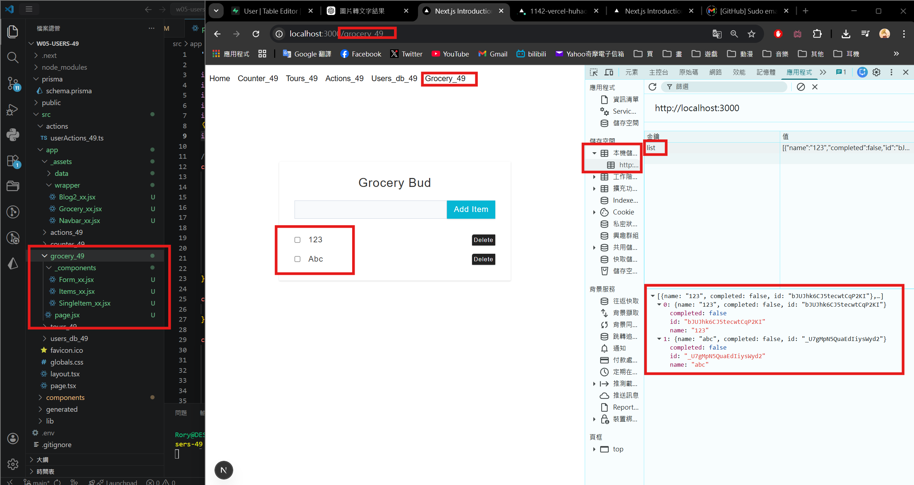
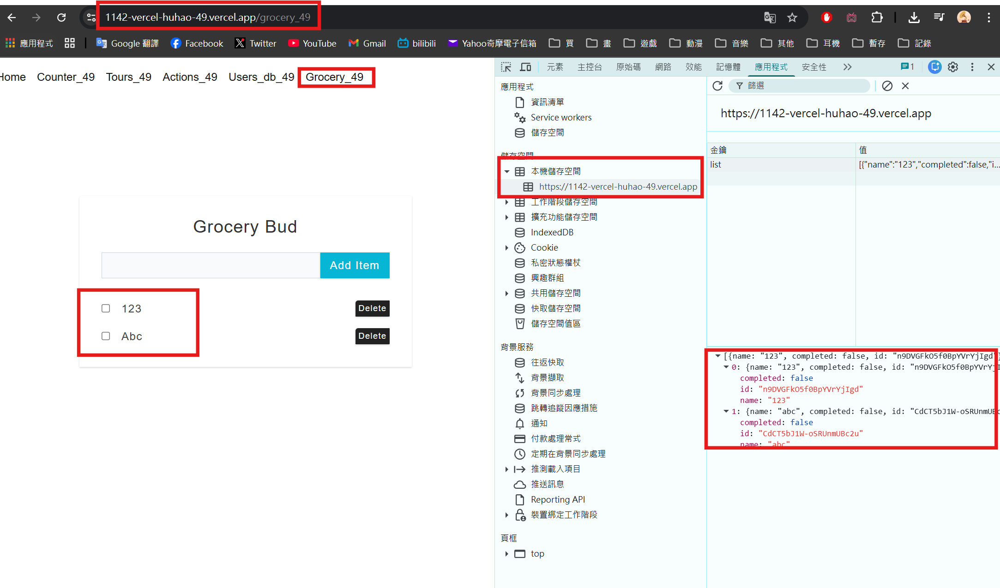
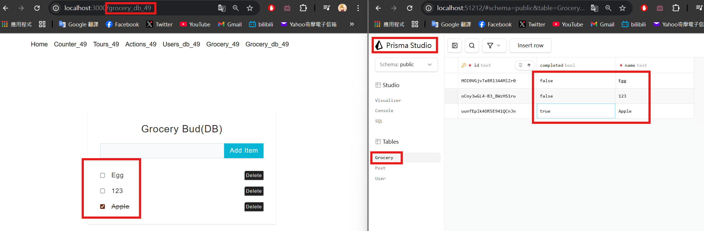
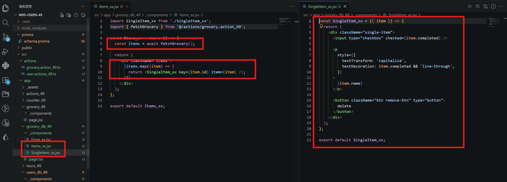
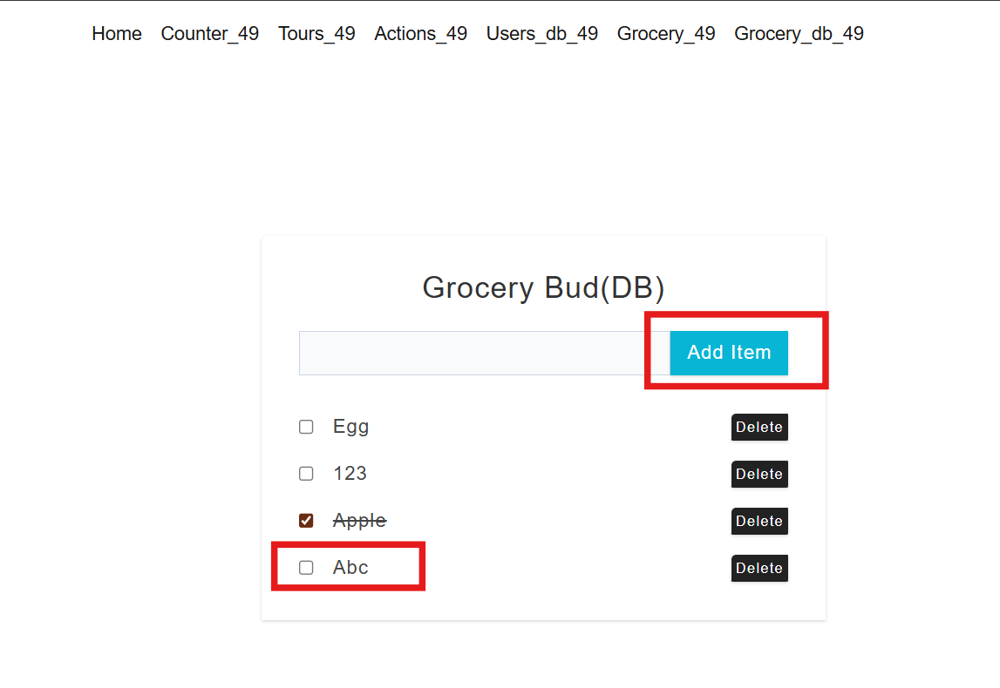
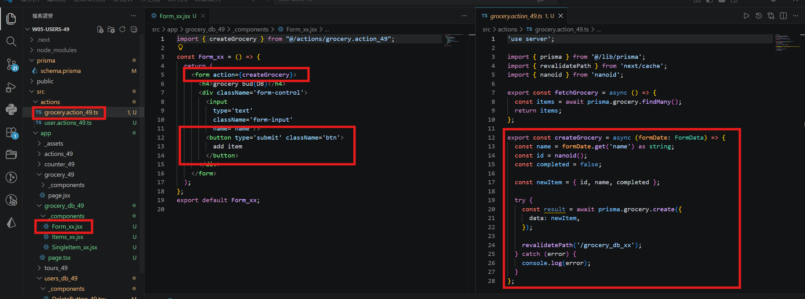

[Github URL](https://github.com/rory12392/1142-demo-huhao-49)

### W07-P1: implement /grocery_xx (client approadh)
 
#### => Add two items, and show the local storage
 

 
```
53a3786 rory12392 Sun Apr 12 17:27:41 2026 +0800 W07-P1: implement /grocery_xx (client approadh)
```

### W07-P2: deploy to Vercel
 
#### => show /grocery_xx in Vercel
 

 
```
a42bdab rory12392 Sun Apr 12 17:53:12 2026 +0800 W07-P2: deploy to Vercel
```

### W07-P3: Grocery READ and CREATE
 
#### => Add 3 items into Grocery database table and fetch these three items (READ)
 

 
#### => code for READ all items
 

 
#### => Add a item cheese (CREATE)
 

 
#### => code for CREATE a item
 

 
```
35ed49f rory12392 Sun Apr 12 18:54:59 2026 +0800 W07-P3: Grocery READ and CREATE
```

### W07 logs: git logs of W07


