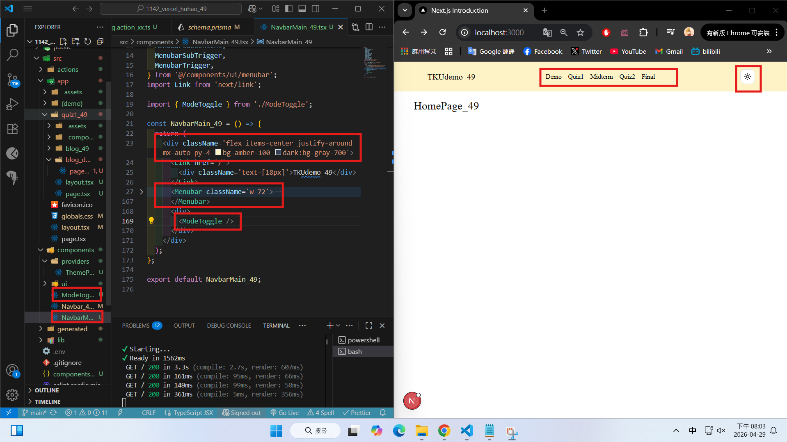
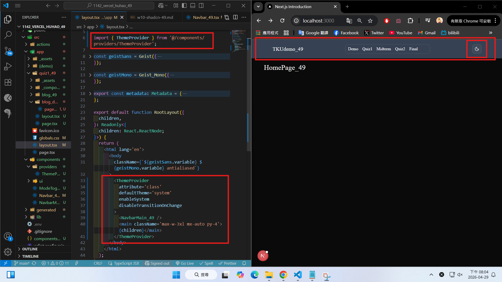
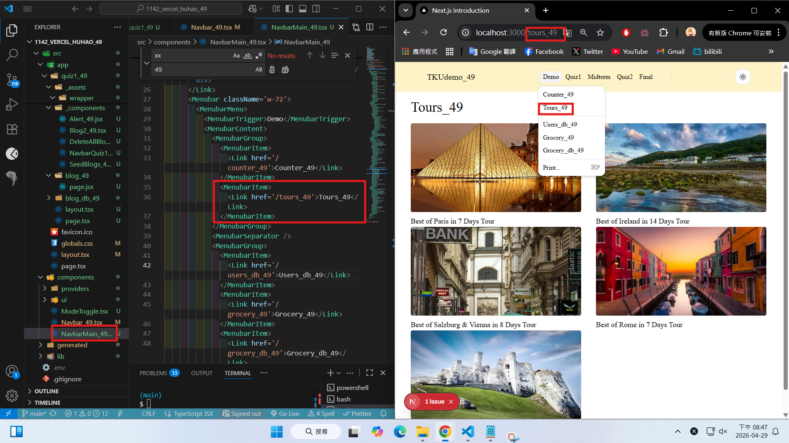
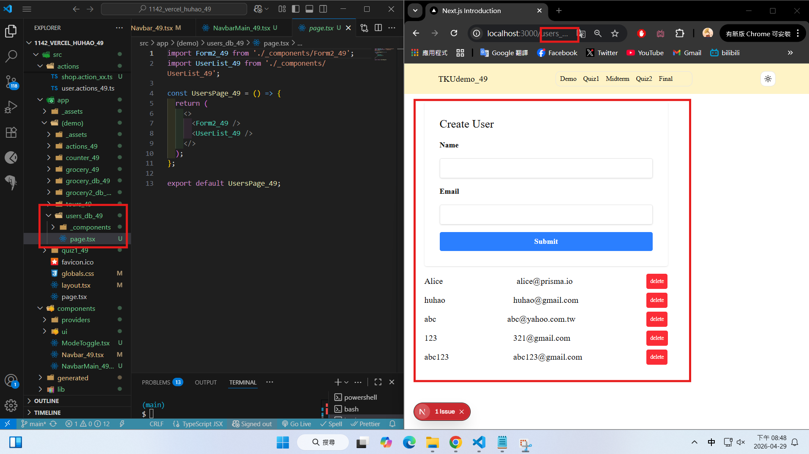
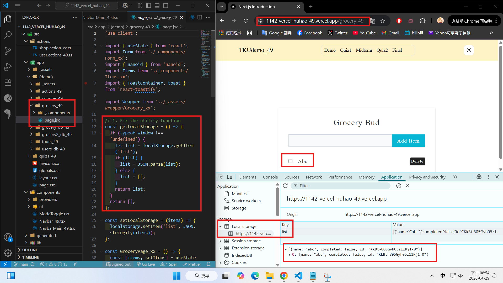
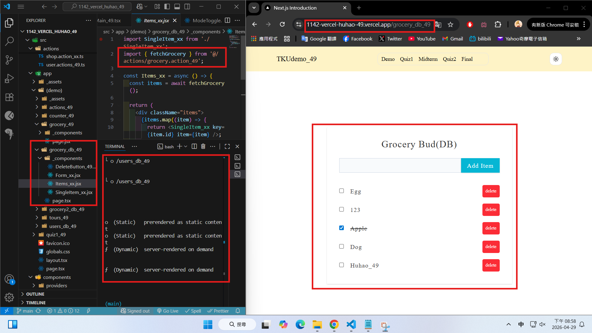

[Github URL](https://github.com/rory12392/1142-demo-huhao-49)

[Vercel URL](1142-vercel-huhao-49.vercel.app)

### W10-P1: Move all routes under app into (demo) folder, and run Tour successfully

#### => Chrome with code


```
513b880 rory12392 Wed Apr 29 18:57:01 2026 +0800 W10-P1: Move all routes under app into (demo) folder, and run Tour successfully
```

### W10-P2: Create NavbarMain_xx with 5 menubar and a ModeToggle that can change theme

#### => light mode, code for MavbarMain_xx



#### => dark mode, ThemeProvider setup



```
5e14587 rory12392 Wed Apr 29 20:06:05 2026 +0800 W10-P2: Create NavbarMain_xx with 5 menubar and a ModeToggle that can change theme
```

### W10-P3: Implement Demo menubar with 5 items

#### => Show Tours_xx (local)



#### => Show Users_db_xx (local)



#### => Show Grocery_xx in Vercel



#### => Show Grocery_db_xx in vercel



```

```

### W10 logs: git logs of W10


