[Github URL](https://github.com/rory12392/1142-demo-huhao-49)

[Vercel URL](1142-vercel-huhao-49.vercel.app)

### W11-P1: Clerk Setup and test
 
#### => Sign In using Github
 
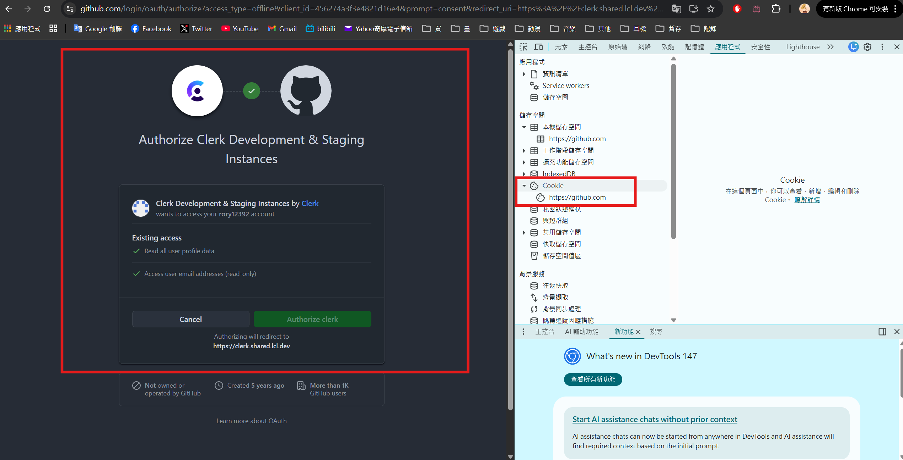
 
#### => get jwt token from Clerk
 
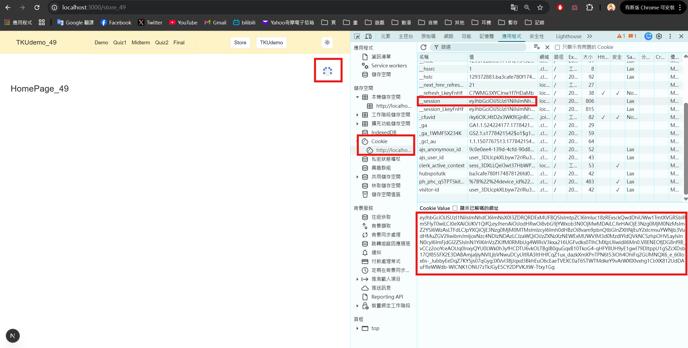
 
#### => verify jwt token from jwt.io
 
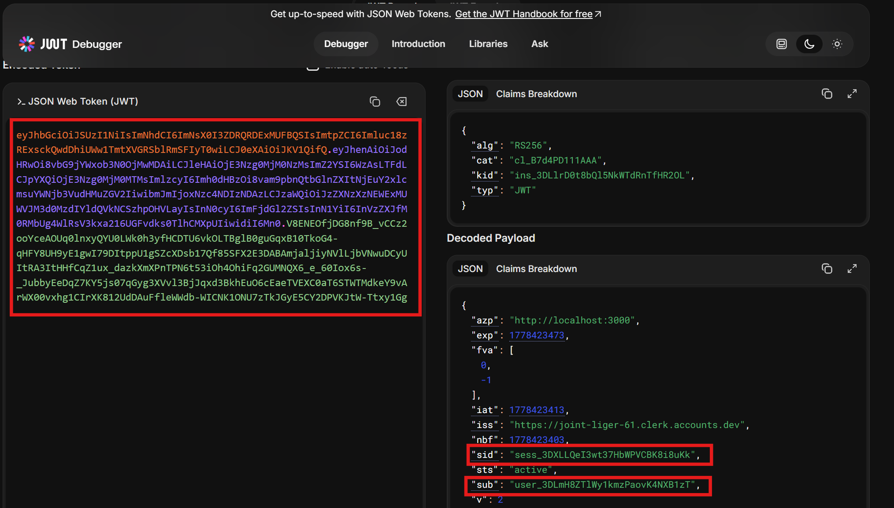
 
#### => get User_ID from Clerk
 
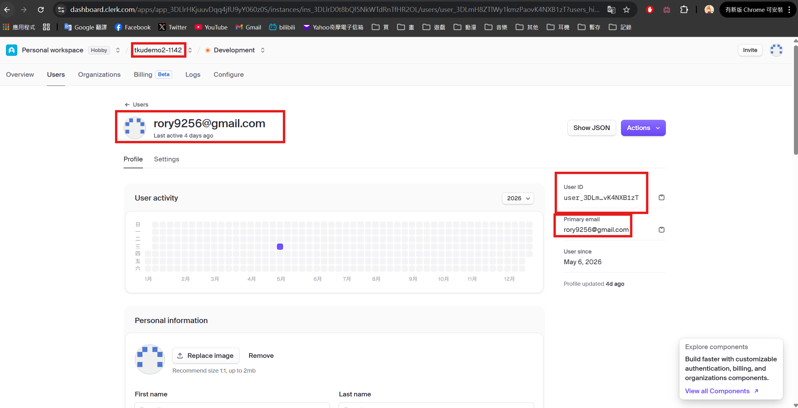
 
#### => set ADMIN_USER_ID using this User_ID
 
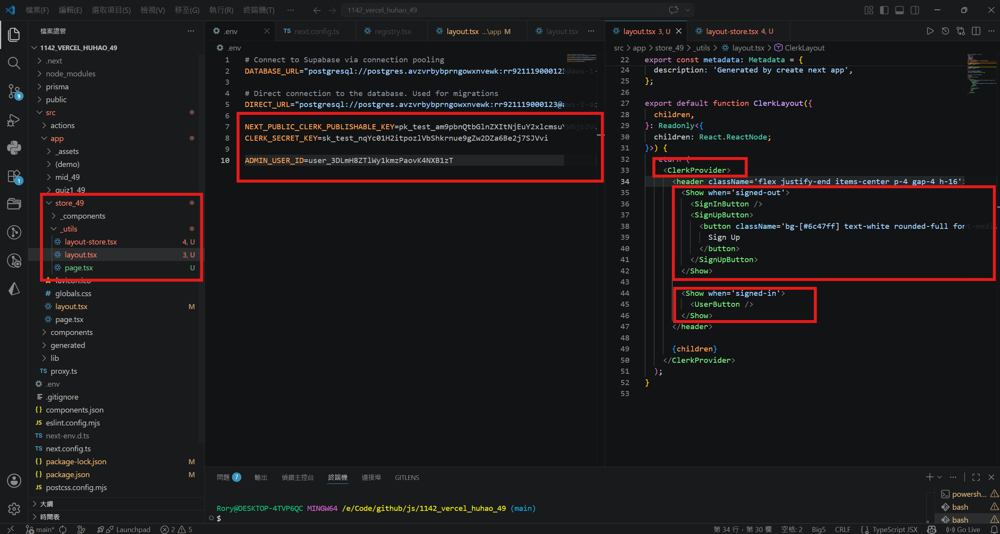
 
```
0f8d067 rory12392 Sun May 10 22:44:20 2026 +0800 W11-P1: Clerk Setup and test
```

### W11-P2: Make code work in Vercel
 
#### => npm run build successfully
 
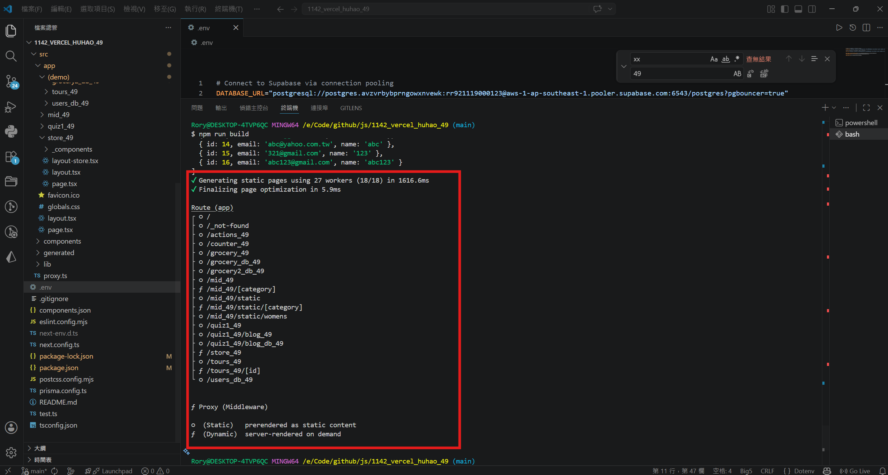
 
#### => add new env to Vercel
 
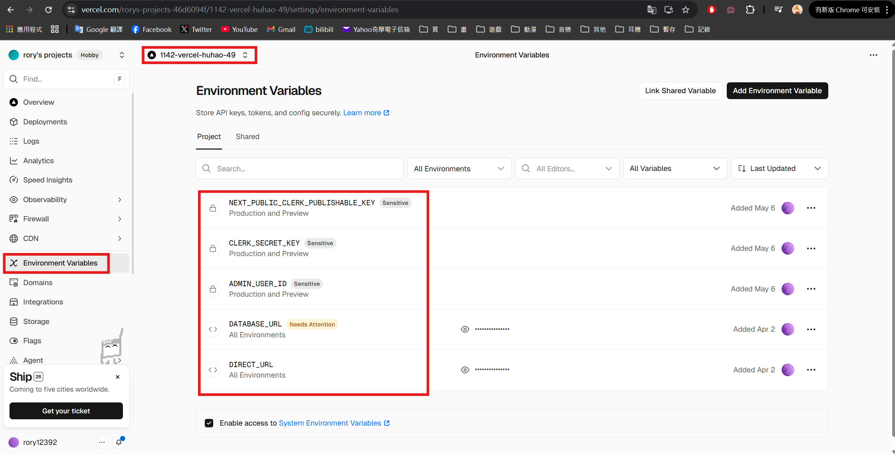
 
#### => test in Vercel, not yet login
 
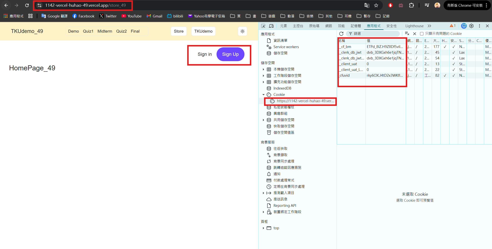
 
#### => test in Vercel, login and get jwt token
 
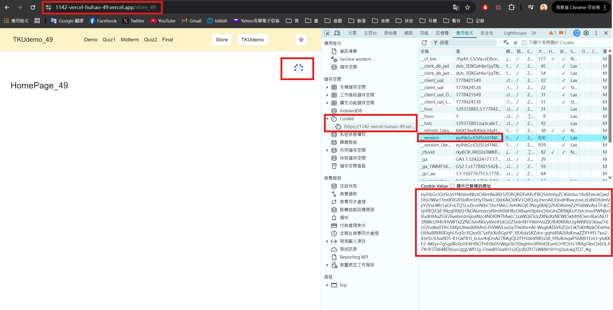
 
```
b7cb83b rory12392 Sun May 10 22:50:33 2026 +0800 W11-P2: Make code work in Vercel
```

### W11-P3: Make /mid_xx to work in Vercel
 
#### => show Mens products
 
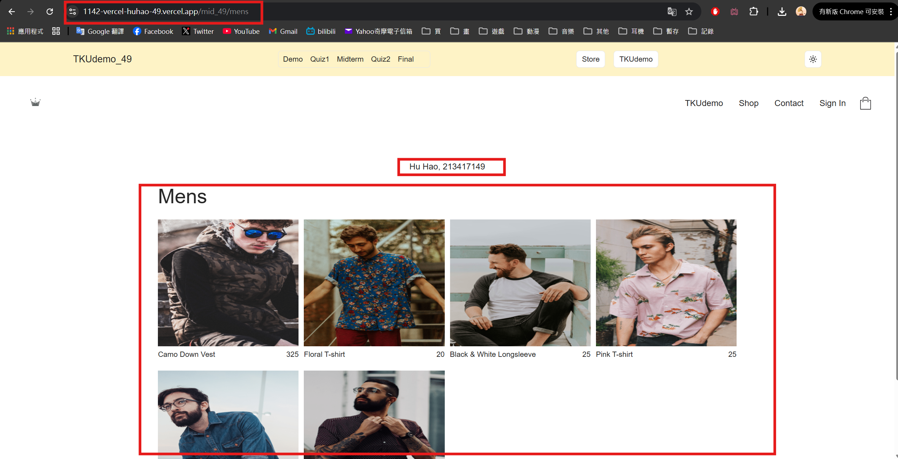
 
```
 
```

### W11 logs: git logs of W11

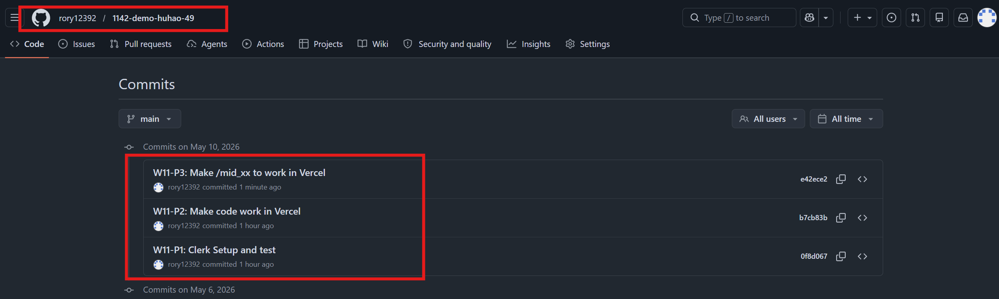
