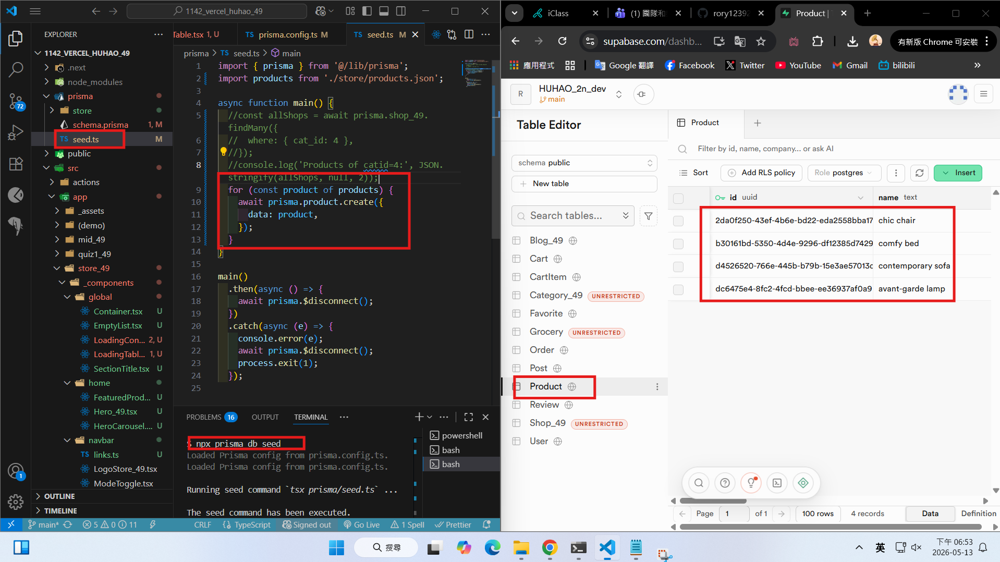
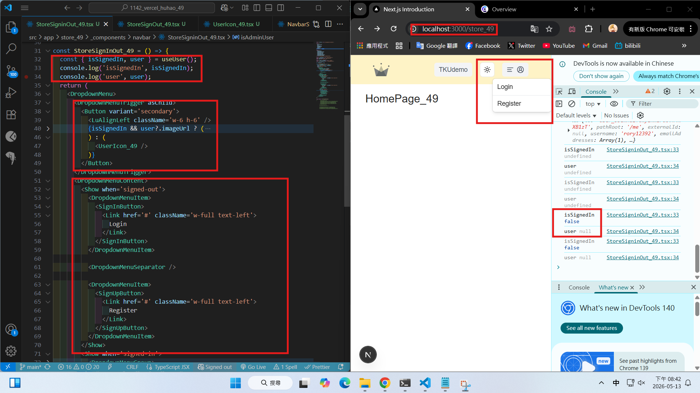
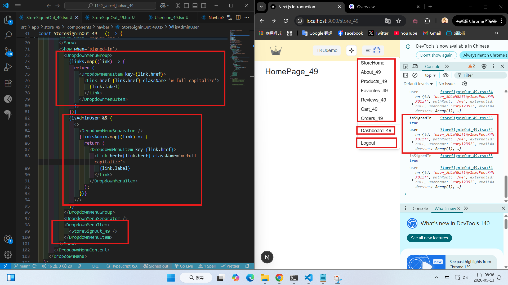
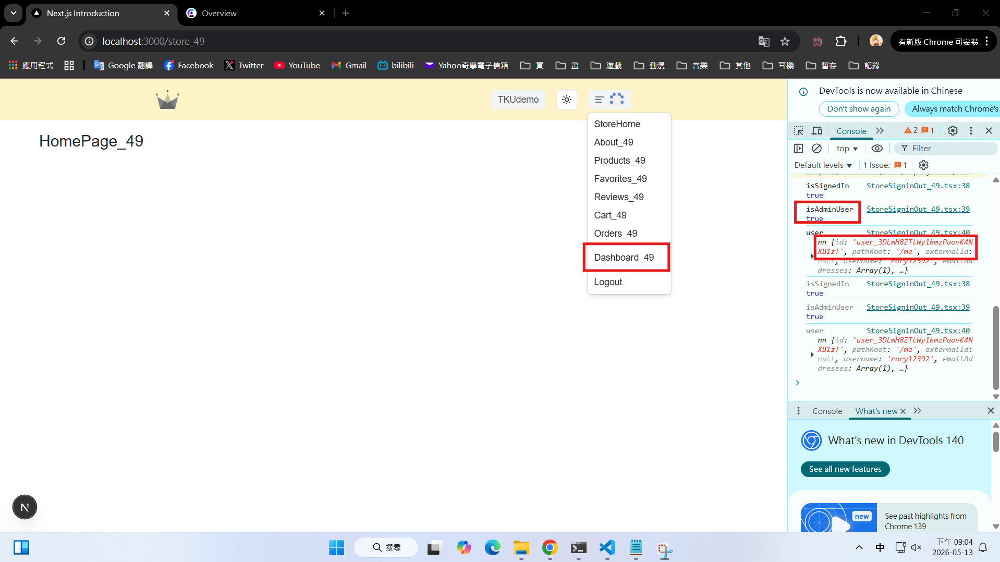
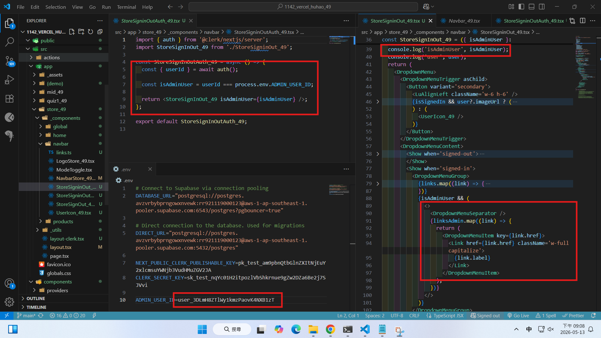
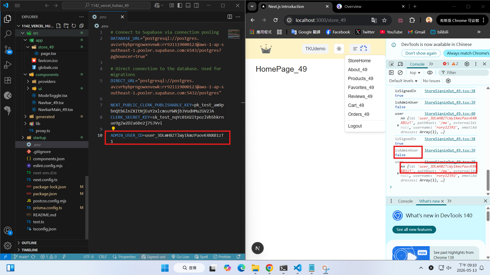
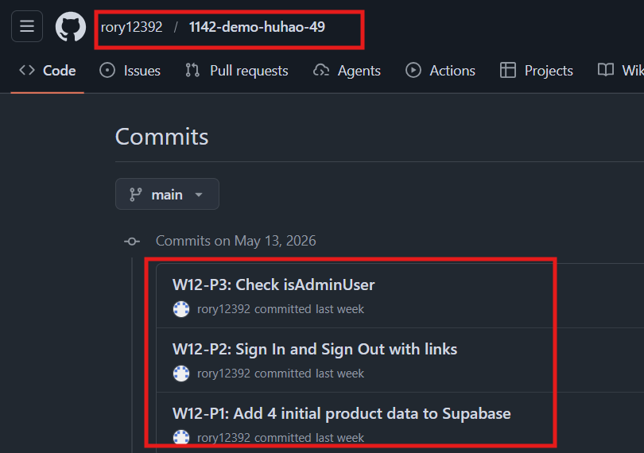

[Github URL](https://github.com/rory12392/1142-demo-huhao-49)

[Vercel URL](1142-vercel-huhao-49.vercel.app)

### W12-P1: Add 4 initial product data to Supabase

#### => npx prisma db seed to add 4 data



```
7fbad74 rory12392 Wed May 13 19:03:33 2026 +0800  W12-P1: Add 4 initial product data to Supabase
```

### W12-P2: Sign In and Sign Out with links

#### => Not signed in, show Login and Register



#### => already signed in, show links, linksAdmin, and Logout



```
f75d343 rory12392 Wed May 13 20:44:09 2026 +0800  W12-P2: Sign In and Sign Out with links
```

### W12-P3: Check isAdminUser

#### => isAdminUser is true, shown in Chrome



#### => related code for checking isAdminUser



#### => isAdminUser is false



```
5527172 rory12392 Wed May 13 21:11:13 2026 +0800  W12-P3: Check isAdminUser
```

### W12 logs: git logs of W12


