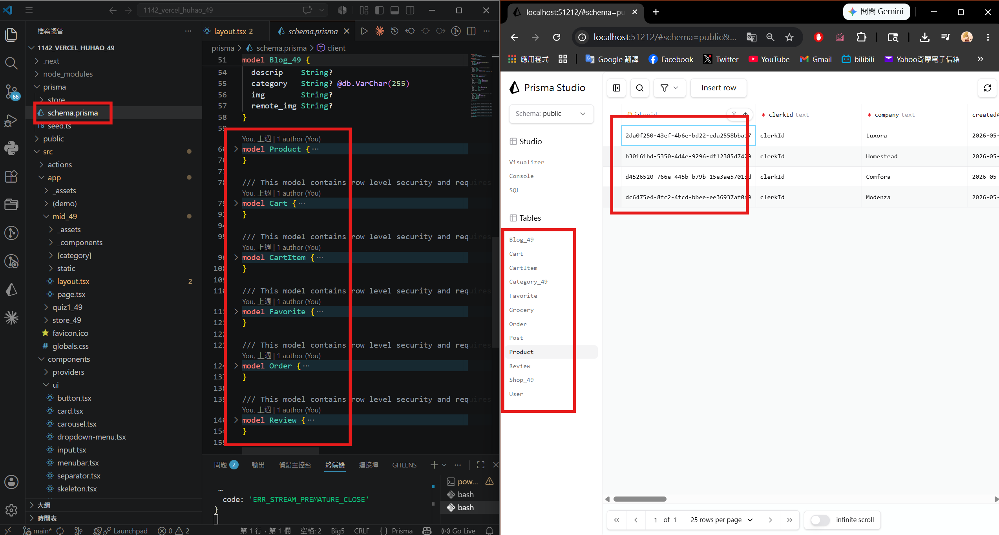
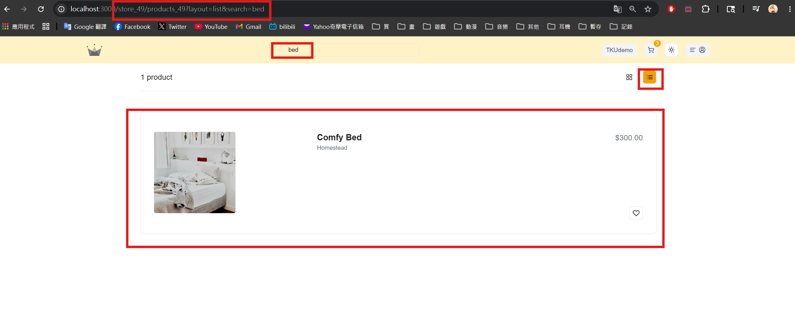
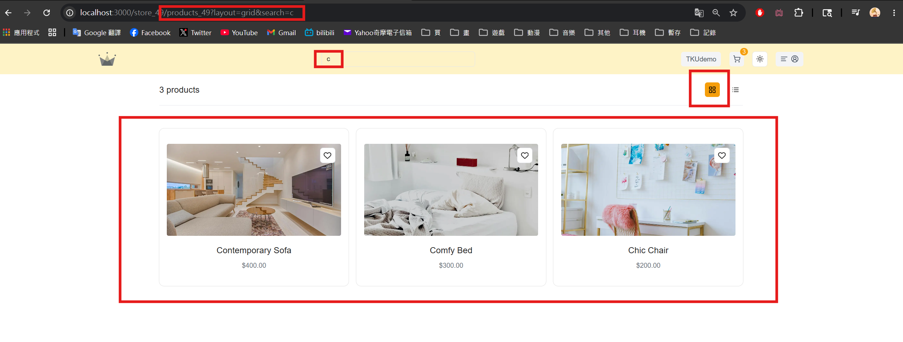
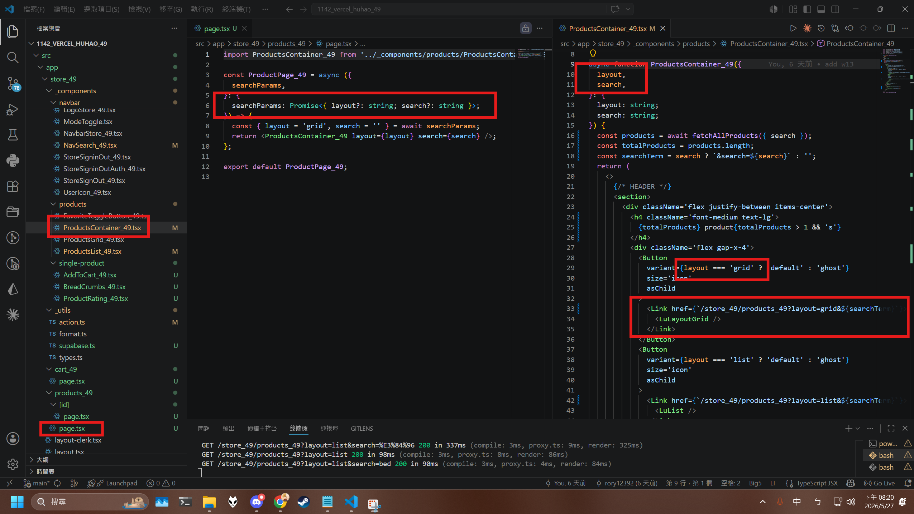
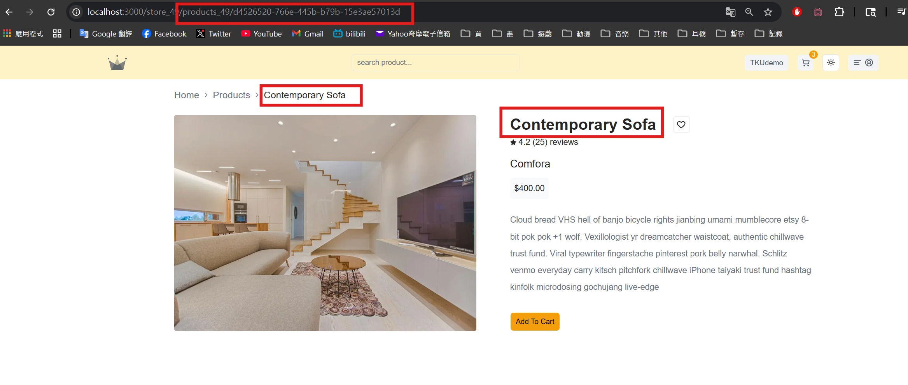
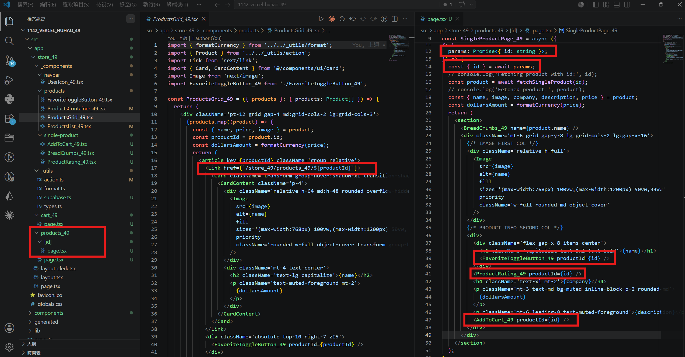
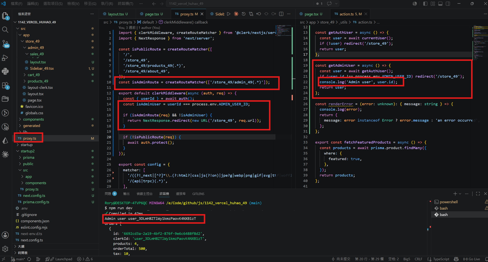
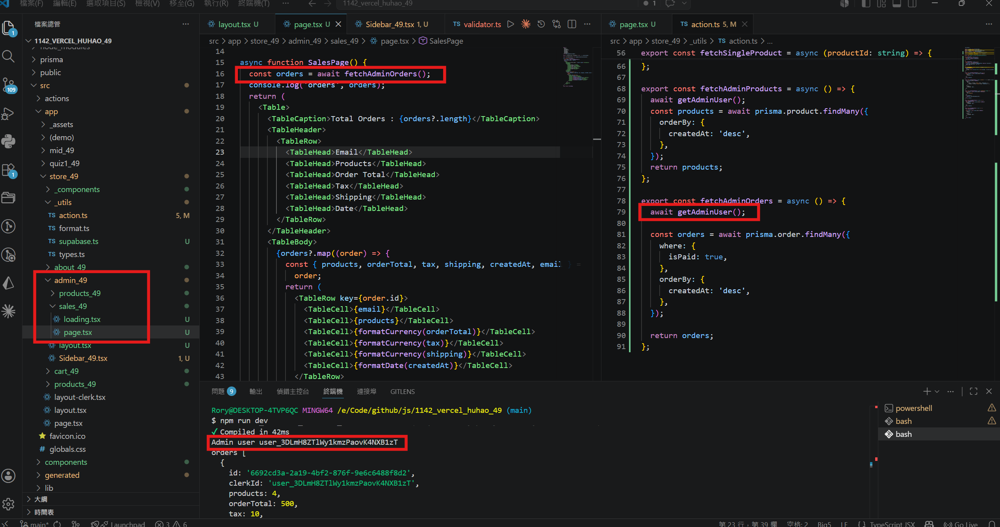
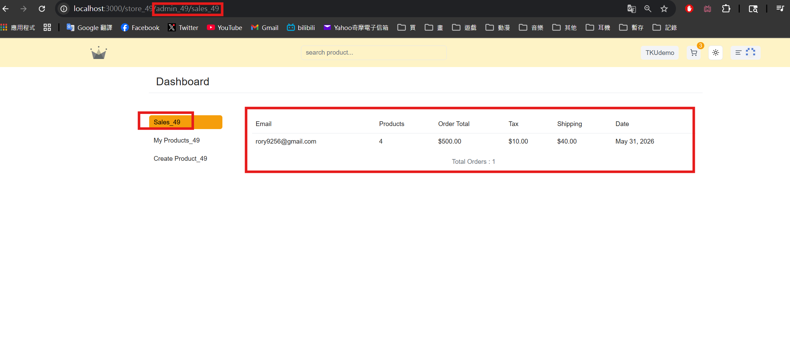
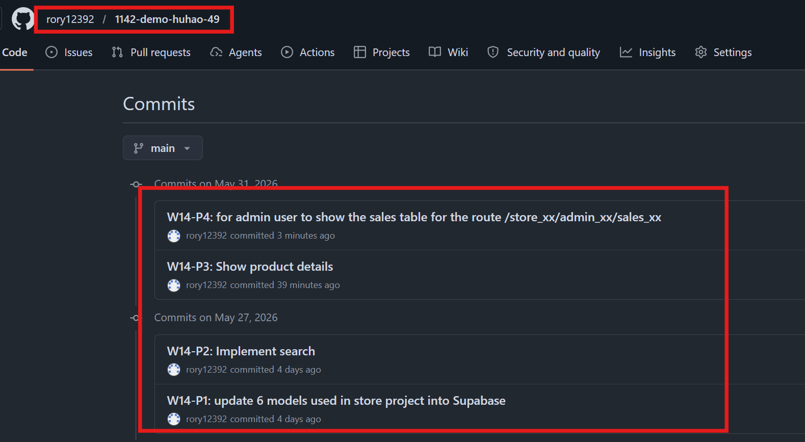

[Github URL](https://github.com/rory12392/1142-demo-huhao-49)

[Vercel URL](1142-vercel-huhao-49.vercel.app)

### W14-P1: update 6 models used in store project into Supabase
 
#### => npx prisma db push
 

 
```
9831453 rory12392 Wed May 27 18:49:14 2026 +0800 W14-P1: update 6 models used in store project into Supabase
```

### W14-P2: Implement search
 
#### => params: "layout=list&search=bed"
 

 
#### => params: "layout=grid&search=c"
 

 
#### => related code for "layout=grid&search=c"
 

 
```
79266dc rory12392 Wed May 27 20:25:25 2026 +0800 W14-P2: Implement search
```

### W14-P3: Show product details
 
#### => Chrome output
 

 
#### => related code
 

 
```
e191c92 rory12392 Sun May 31 16:25:15 2026 +0800 W14-P3: Show product details
```

### W14-P4: for admin user to show the sales table for the route /store_xx/admin_xx/sales_xx
 
#### => proxy.tsx and getAdminUser
 

 
#### => code for checking admin user
 

 
#### => Chrome display
 

 
```

```

### W14 logs: git logs of W14


