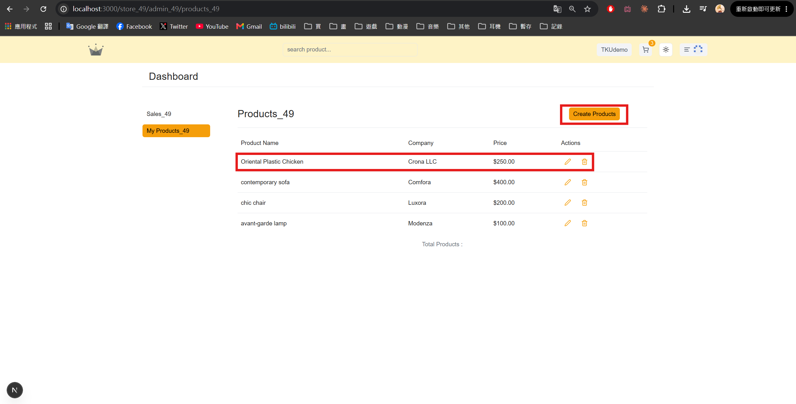
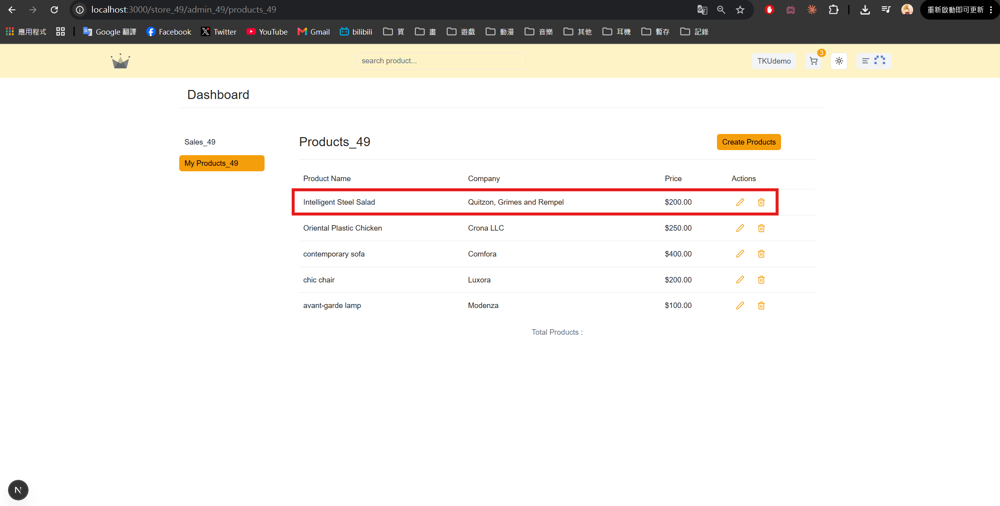
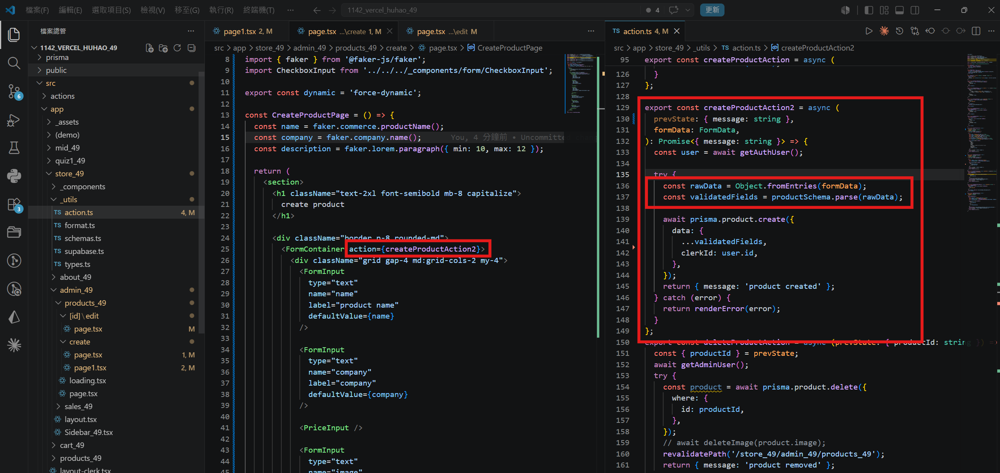
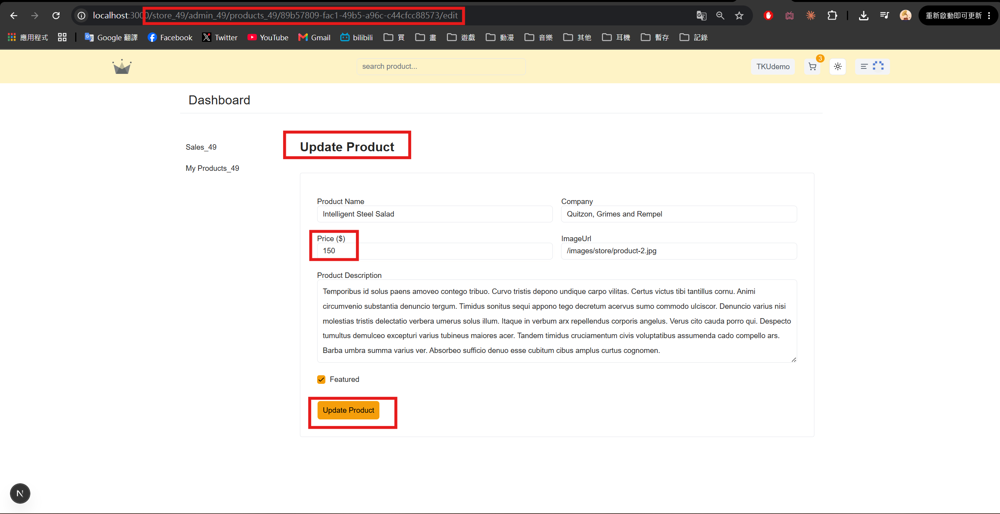
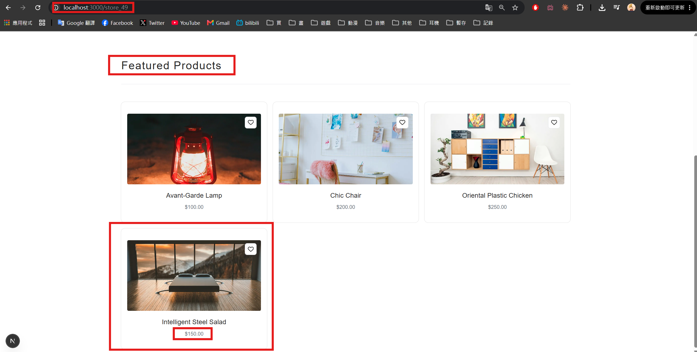

[Github URL](https://github.com/rory12392/1142-demo-huhao-49)

[Vercel URL](1142-vercel-huhao-49.vercel.app)

### W15-P1: Shown in Vercel

#### => local demo


#### => success of npm run build


#### => Vercel demo


```
33e1bd4 rory12392 Wed Jun 3 19:58:47 2026 +0800 W15-P1: Shown in Vercel
```

### W15-P2: Show AdminProducts table for CRUD

#### => Chrome demo (initial 4 products)


#### => Chrome demo (delete a product, 3 left)


#### => relevant code


```
1006d39 rory12392 Wed Jun 3 20:26:00 2026 +0800 W15-P2: Show AdminProductstable for CRUD
```

### W15-P3: Create Product and Update Product
 
#### => Chrome, create a product using createProductAction
 

 
#### => Chrome, create a product using createProductAction2
 

 
#### => relevant code for creating a product using createProductAction2
 

 
#### => Update a featured product
 

 
#### => Show in featured product
 

 
```
38de9d5 rory12392 Wed Jun 10 17:04:52 2026 +0800 W15-P3: Create Product andUpdate Product
```

### W15 logs: git logs of W15


